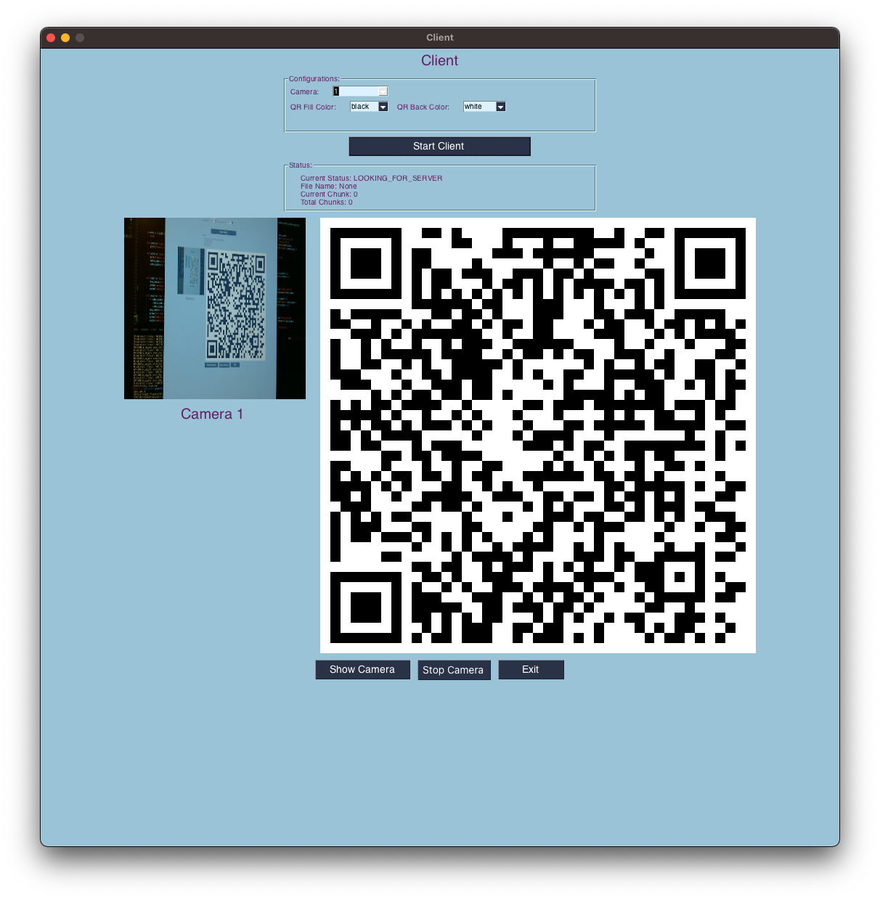

# qrcode-file-transfer
A Python package that can be used to transfer files with QR codes. Input a file, get QR code images. Print, email, or otherwise share your codes. Re-input these QR codes, get your original file back.

# Protocol diagram

# Usage

## Arguments

## Example

## Tips

# Installation
## Requirements
* Python 3
* Encode
  * qrcode
  * Image
* Decode
  * Pillow
  * numpy
  * zbar-py

## From source
1. Clone the repository
2. Run `make install`
    * This command uses pip to install a wheel. If you are using a python virtual environment, be sure to activate it before installing.

## From source without installing
1. Clone the repo
2. Install dependencies via `pip install -r requirements.txt`
3. Invoke the module from the root of the repo: `python -m qrcode_file_transfer <args>`