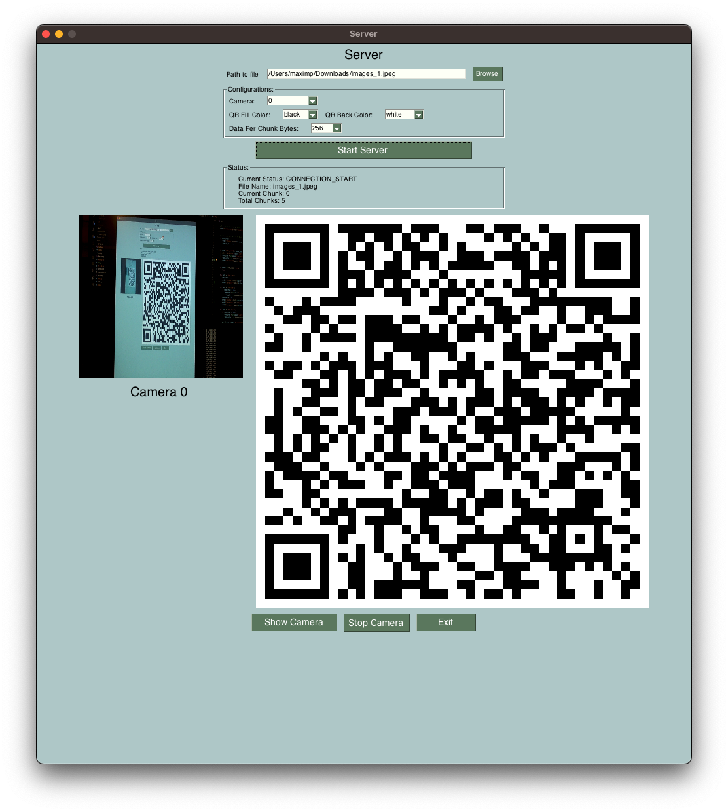

# qrcode-file-transfer

This Python-based client-server application facilitates data transfer using QR codes. It employs cameras on both the server and client sides to scan QR codes, enabling seamless data transmission.

# Protocol diagram

## Example

### Client

### Server

## Tips

# Installation
## Requirements
* Python 3
* Imutils
* PySimpleGUI
* Encode
  * qrcode
  * Image
* Decode
  * Pillow
  * numpy
  * zbar-py

## From source without installing
### Server
1. Clone the repo
2. Install dependencies via `pip install -r requirements.txt`
3. Run the server by running the following command `python server.py`

### Client
1. Clone the repo
2. Install dependencies via `pip install -r requirements.txt`
3. Run the server by running the following command `python client.py`